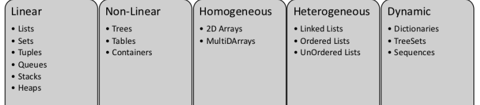

## Memory Analyzer Tool for 内存快照
### https://arthas.aliyun.com/
### https://lp.jetbrains.com/intellij-idea-profiler/?source=google&medium=cpc&campaign=APAC_en_ASIA_IDEA_Profiler_Search&term=memory%20analysis
### https://eclipse.dev/mat/

Tools
//========================================================================
https://github.com/mcollina/autocannon
分布式解决方案
aliyun seata.apache.org

go lib
gtoken

https://github.com/alibabacloud-go/tea-utils

工单系统
https://github.com/lanyulei/ferry

TeaWeb - 可视化的Web代理服务
https://github.com/TeaWeb/build

data structures 

业务需要- 存储与读写特性 - 选择底层存储结构 - 实现逻辑结构 

Lists, Sets, Tuples, Queues, Stacks, 

Brute force algorithms
Divide and conquer algorithms
Backtracking algorithms
//========================================================================

go - code more - 能按时完成开发任务 - 思考架构 - 阅读热门开源代码（重点梳理流程而非细节）- 借鉴源代码 - 软件设计 - 架构师
阅读源代码的姿势：以 go-restful -  带着特定的问题-  梳理流程图
